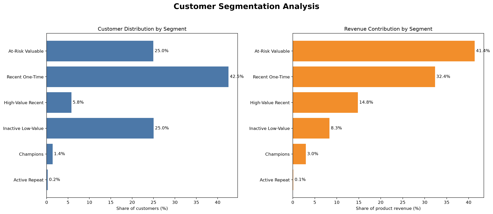
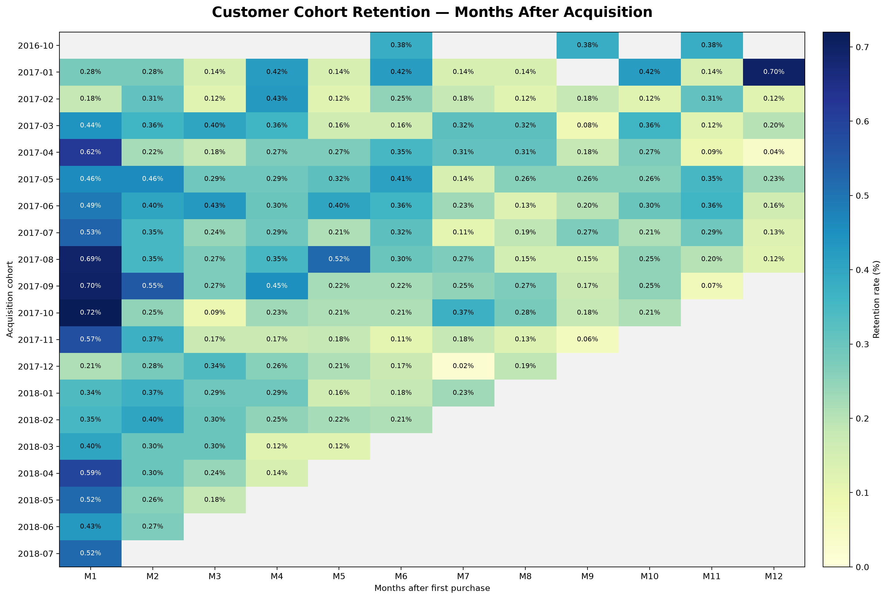
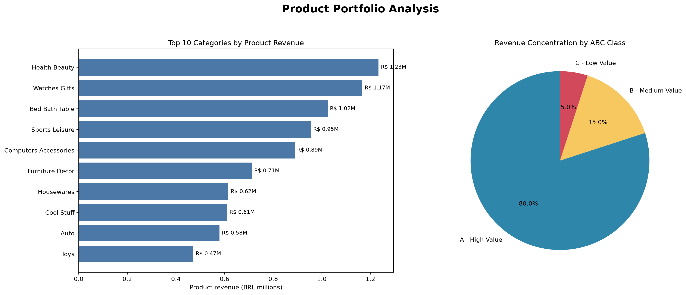
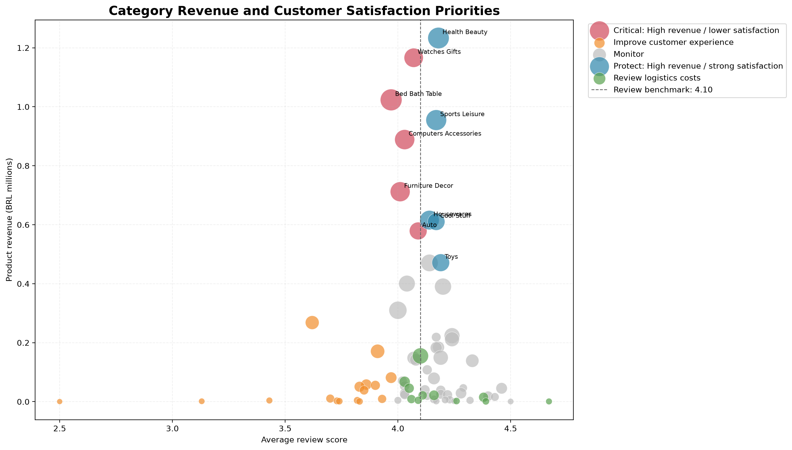

# Customer & Revenue Intelligence Platform

An end-to-end retail analytics project using Python, PostgreSQL, SQL, Pandas, and Matplotlib to analyse customer behaviour, revenue, retention, product performance, and business opportunities.

The project uses the Olist Brazilian E-Commerce dataset and demonstrates a complete analytics workflow from raw CSV ingestion to reusable database views, Python analysis, visualisation, and business recommendations.

## Project Objectives

- Measure orders, customers, product revenue, and freight value
- Segment customers using RFM analysis
- Compare one-time and repeat customer behaviour
- Measure monthly cohort retention
- Identify high-performing products and categories
- Evaluate customer satisfaction by category
- Perform ABC product-revenue concentration analysis
- Translate analytical findings into business recommendations

## Analytics Pipeline

```text
Raw CSV files
    ↓
Python data loading
    ↓
PostgreSQL database
    ↓
SQL validation and analysis
    ↓
Reusable analytical views
    ↓
Python and Pandas analysis
    ↓
Charts, summaries, and business insights
```

## Technologies

- Python
- Pandas
- PostgreSQL
- SQL
- SQLAlchemy
- Matplotlib
- Git and GitHub
- VS Code
- pgAdmin

## Project Structure

```text
customer-revenue-intelligence/
├── data/
│   ├── raw/
│   └── processed/
├── docs/
│   ├── business_questions.md
│   ├── business_recommendations.md
│   └── data_dictionary.md
├── images/
│   ├── customer_segmentation_analysis.png
│   ├── cohort_retention_heatmap.png
│   ├── product_category_analysis.png
│   └── category_priority_matrix.png
├── python/
│   ├── 01_load_data.py
│   ├── 02_extract_analysis_data.py
│   ├── 03_customer_segmentation.py
│   ├── 04_cohort_retention.py
│   └── 05_product_analysis.py
├── sql/
│   ├── 01_database_checks.sql
│   ├── 02_data_quality.sql
│   ├── 03_revenue_analysis.sql
│   ├── 04_customer_analysis.sql
│   ├── 05_create_views.sql
│   ├── 06_cohort_analysis.sql
│   └── 07_product_analysis.sql
├── .gitignore
├── README.md
└── requirements.txt
```

## Python Workflow

### `01_load_data.py`

Loads the nine raw Olist CSV files into PostgreSQL tables.

### `02_extract_analysis_data.py`

Extracts the analytical PostgreSQL views into processed CSV files for reproducible Python analysis.

### `03_customer_segmentation.py`

Creates a customer-segment summary and compares customer share with revenue contribution.

### `04_cohort_retention.py`

Builds a cohort-retention matrix and generates a retention heatmap.

### `05_product_analysis.py`

Analyses product categories, ABC revenue concentration, customer satisfaction, freight burden, and category priorities.

## SQL Workflow

The SQL scripts should be executed in numerical order:

1. Database validation
2. Data-quality assessment
3. Revenue analysis
4. Customer and RFM analysis
5. Reusable database views
6. Cohort-retention analysis
7. Product and category analysis

## Key Findings

- Approximately 97% of customers purchased only once.
- Repeat customers represented approximately 3% of customers.
- Weighted month-one customer retention was only 0.48%.
- At-Risk Valuable customers represented 24.96% of customers but generated 41.39% of product revenue.
- Recent One-Time customers formed the largest segment at 42.55%.
- Health and Beauty was the highest-revenue category, generating R$1.23 million.
- Office Furniture had the lowest average review score among established categories at 3.62.
- ABC Class A contained 8,351 products that generated 80% of product revenue.
- Several high-revenue categories combined strong commercial performance with weaker customer satisfaction.

## Visual Outputs

### Customer Segmentation



### Cohort Retention



### Product Portfolio



### Category Priorities



## Setup

### 1. Create and activate a virtual environment

```powershell
python -m venv .venv
Set-ExecutionPolicy -Scope Process -ExecutionPolicy RemoteSigned
.\.venv\Scripts\Activate.ps1
```

### 2. Install dependencies

```powershell
pip install -r requirements.txt
```

### 3. Configure PostgreSQL

Create a `.env` file in the project root:

```text
DB_HOST=localhost
DB_PORT=5432
DB_NAME=customer_revenue_intelligence
DB_USER=your_postgresql_username
DB_PASSWORD=your_postgresql_password
```

The `.env` file is excluded from Git.

### 4. Add the dataset

Place the nine Olist CSV files inside:

```text
data/raw/
```

Raw and generated datasets are excluded from Git.

### 5. Load the source data

```powershell
python .\python\01_load_data.py
```

### 6. Execute the SQL scripts

Run the files in the `sql` directory in numerical order using pgAdmin.

### 7. Run the Python analysis

```powershell
python .\python\02_extract_analysis_data.py
python .\python\03_customer_segmentation.py
python .\python\04_cohort_retention.py
python .\python\05_product_analysis.py
```

## Business Recommendations

- Develop targeted reactivation campaigns for high-value customers at risk.
- Convert recent one-time buyers through post-purchase communication and second-order incentives.
- Investigate high-revenue categories with weaker customer satisfaction.
- Review categories with disproportionately high freight costs.
- Prioritise high-value Class A products while rationalising low-contribution catalogue items.

More details are available in [`docs/business_recommendations.md`](docs/business_recommendations.md).

## Data Note

The raw Olist datasets and generated processed CSV files are intentionally excluded from the repository. Users must obtain the public Olist Brazilian E-Commerce dataset separately.